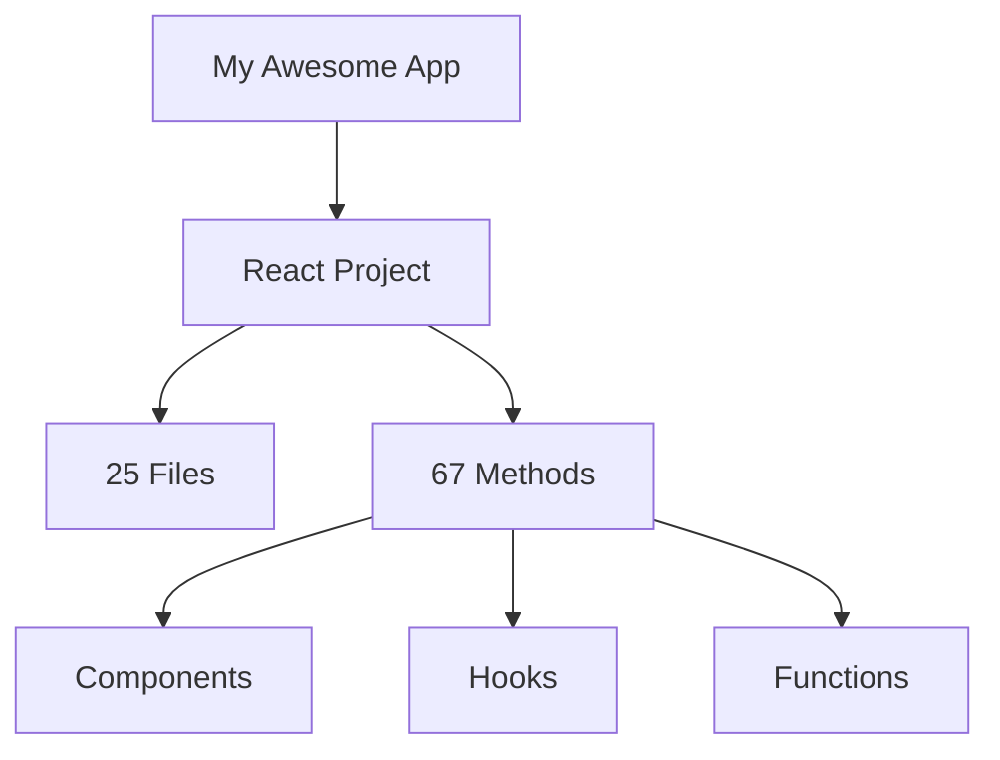

# 🌊 Flow - Installation Guide

**The trendy universal workflow generator** - Super simple installation and usage!

## 🚀 Quick Install

```bash
# Install globally (recommended)
npm install -g flow

# That's it! Now you have the 'flow' command
```

## ✨ Super Simple Usage

```bash
# Generate beautiful workflows
flow generate

# Quick project analysis
flow analyze

# Detect frameworks
flow detect

# Get optimization tips
flow optimize
```

## 🎯 What You Get

After running `flow generate`:

```
🌊 Flow - Universal Workflow Generator
=====================================
📁 Input: ./src
📁 Output: ./workflows
📊 Framework: react (auto-detected)
📊 Language: typescript (auto-detected)

🔍 Scanning your project...
🎨 Creating beautiful diagrams...
📄 Generated JSON report
🌊 Generated Mermaid diagram
📊 Generated visual diagrams

✅ Successfully generated 15 workflows
⏱️  Execution time: 2.3s
💾 Memory usage: 45MB
📊 Cache hits: 12
📊 Cache misses: 3

📁 Output directory: ./workflows
📊 Diagrams: ./workflows/diagrams
📄 Workflows: ./workflows/workflows
🌊 Mermaid: ./workflows/mermaid
```

## 🎨 Generated Files

- **`workflows.json`** - Structured data
- **`workflows.yaml`** - Human-readable config
- **`workflow.mmd`** - Mermaid diagrams
- **`diagrams/`** - Visual PNG/SVG/PDF exports
- **`report.html`** - Interactive web report

## 🌟 Why 'flow' is Perfect

### **Trendy & Memorable:**
- **Short** - Just 4 letters
- **Intuitive** - Flow of your code
- **Modern** - Sounds like trendy tools
- **Easy** - Anyone can remember it

### **Follows Popular Patterns:**
- `npm` - Node Package Manager
- `yarn` - Yet Another Resource Negotiator
- `flow` - Code Flow Visualizer ✨

## 🚀 Advanced Usage

```bash
# Specify framework
flow generate --framework react

# Custom output directory
flow generate --output ./my-reports

# Enable parallel processing
flow generate --parallel --workers 8

# Include optimizations
flow generate --optimize

# Generate specific formats
flow generate --format json --diagram-format svg
```

## 🎯 Supported Frameworks

Auto-detects and works with:
- ✅ **React** - Components, hooks, functions
- ✅ **Vue.js** - Single-file components
- ✅ **Angular** - Services, components
- ✅ **Node.js** - Express routes, middleware
- ✅ **Next.js** - Pages, API routes
- ✅ **Svelte** - Components
- ✅ **PHP** - Classes, methods
- ✅ **Python** - Functions, classes
- ✅ **Any JavaScript/TypeScript**

## 💡 Examples

```bash
# React project
cd my-react-app
flow generate

# Vue.js project
cd my-vue-app
flow generate --output ./vue-analysis

# Node.js API
cd my-api
flow analyze

# Any project
flow generate -i /path/to/project -o /path/to/output
```

## 🎨 Sample Output

### Mermaid Diagram:


### HTML Report:
- Beautiful web interface
- Interactive charts
- Method breakdown
- Framework detection
- Performance metrics

## 🚀 That's It!

Just like `npm install`, `yarn add` - now you have `flow generate`!

**Super simple, super trendy, super powerful!** 🌊

---

**Made with ❤️ for developers who love simple, trendy tools**
