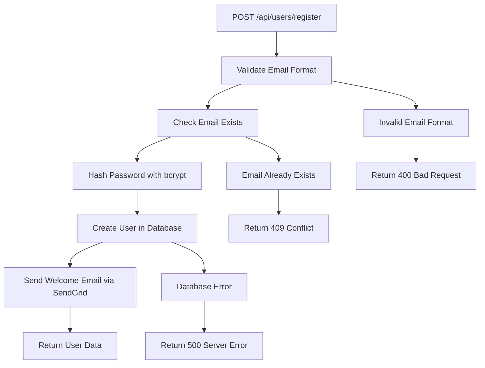

# 🌊 Flow

**The trendy universal workflow generator** - Generate beautiful workflow diagrams from any npm project. Whether it's React, Vue.js, Node.js, or any other framework - Flow has you covered!

## 🚀 Features

### Universal Support
- **Frontend Frameworks**: React, Vue.js, Angular, Svelte, Next.js
- **Backend Frameworks**: Node.js, Express, NestJS, Fastify
- **Languages**: JavaScript, TypeScript, JSX, TSX, Vue SFC
- **Auto-Detection**: Automatically detects frameworks and languages

### Advanced Analysis
- **Code Parsing**: Extracts methods, functions, classes, and components
- **Dependency Analysis**: Identifies imports, exports, and dependencies
- **API Call Detection**: Finds HTTP requests and API integrations
- **Database Query Analysis**: Identifies database operations and ORM usage
- **Validation Rules**: Extracts form validation and data validation logic
- **Lifecycle Events**: Detects framework-specific lifecycle methods

### Performance & Scalability
- **Parallel Processing**: Multi-threaded execution for large codebases
- **Intelligent Caching**: Reduces processing time for repeated operations
- **Memory Optimization**: Efficient memory usage for large projects
- **Worker Threads**: Utilizes multiple CPU cores for better performance

### Multiple Output Formats
- **JSON**: Structured data for programmatic use
- **YAML**: Human-readable configuration format
- **Mermaid**: Interactive flowcharts and diagrams
- **Visual Diagrams**: PNG, SVG, PDF exports
- **HTML Reports**: Interactive web-based reports

## 📦 Installation

```bash
# Global installation (trendy!)
npm install -g flow

# Local installation
npm install --save-dev flow

# Using npx (no installation required)
npx flow generate --input ./src --output ./workflows
```

## 🎯 Quick Start

### Real-World Examples

```bash
# 🏪 E-commerce API Analysis
flow generate --input ./src/controllers --output ./docs/api-workflows --format mermaid

# ⚛️ React Component Workflows  
flow generate --input ./src/components --output ./docs/component-workflows --format all

# 📧 Scheduled Tasks & Background Jobs
flow generate --input ./src/jobs --output ./docs/scheduled-workflows --format json

# 🔌 Third-party API Integrations
flow generate --input ./src/services --output ./docs/integration-workflows --format mermaid

# 🗄️ Database Operations
flow generate --input ./src/models --output ./docs/db-workflows --include-database

# 📊 Project Analysis
flow analyze --input ./src --verbose

# 🔍 Framework Detection
flow detect --input ./src
```

### Advanced Usage

```bash
# Specify framework and language
flow generate --input ./src --output ./workflows --framework react --language typescript

# Enable parallel processing and caching
flow generate --input ./src --output ./workflows --parallel --cache --workers 8

# Generate specific output formats
flow generate --input ./src --output ./workflows --format json --diagram-format svg

# Include optimization analysis
flow generate --input ./src --output ./workflows --optimize
```

## 🏗️ Architecture

### Modular Design
The tool is built with a modular architecture where each framework has its own specialized components:

```
src/
├── core/
│   ├── FrameworkDetector.ts    # Auto-detects frameworks
│   ├── WorkflowProcessor.ts    # Main processing engine
│   └── TaskCore.ts            # Separate task cores for efficiency
├── parsers/
│   ├── BaseParser.ts          # Base parser with common functionality
│   ├── ReactParser.ts         # React-specific parsing
│   ├── VueParser.ts           # Vue.js-specific parsing
│   ├── NodeParser.ts          # Node.js-specific parsing
│   └── ...                    # Other framework parsers
├── generators/
│   ├── WorkflowGenerator.ts   # Workflow generation
│   ├── DiagramGenerator.ts    # Visual diagram generation
│   └── MermaidGenerator.ts    # Mermaid diagram generation
└── types/
    └── index.ts               # Universal type definitions
```

### Task Cores
Each major operation has its own dedicated task core for maximum efficiency:

- **ParserTaskCore**: Handles code parsing and analysis
- **GeneratorTaskCore**: Generates workflows and diagrams
- **AnalyzerTaskCore**: Performs code analysis and metrics
- **OptimizerTaskCore**: Suggests performance optimizations

## 🔧 Configuration

### Command Line Options

| Option | Description | Default | Values |
|--------|-------------|---------|--------|
| `--input, -i` | Input project directory | `./src` | Any valid path |
| `--output, -o` | Output directory | `./workflows` | Any valid path |
| `--format, -f` | Output format | `all` | `json`, `yaml`, `mermaid`, `all` |
| `--framework` | Force specific framework | Auto-detect | `react`, `vue`, `angular`, `nodejs`, `nextjs`, `svelte` |
| `--language` | Force specific language | Auto-detect | `javascript`, `typescript` |
| `--parallel` | Enable parallel processing | `true` | `true`, `false` |
| `--cache` | Enable caching | `true` | `true`, `false` |
| `--workers` | Number of worker threads | `4` | Any positive integer |
| `--optimize` | Include optimizations | `false` | `true`, `false` |
| `--verbose, -v` | Verbose output | `false` | `true`, `false` |

### Framework-Specific Options

#### React
- Detects JSX/TSX files
- Analyzes hooks, lifecycle methods, and components
- Identifies state management patterns

#### Vue.js
- Detects .vue single-file components
- Analyzes composition API and options API
- Identifies Vue-specific lifecycle methods

#### Node.js
- Detects Express routes and middleware
- Analyzes database queries and API calls
- Identifies server lifecycle events

#### Angular
- Detects TypeScript decorators
- Analyzes services, components, and modules
- Identifies Angular-specific patterns

## 📊 Real-World Output Examples

### E-commerce User Registration Flow
**Command:** `flow generate --input ./src/controllers/UserController.ts --output ./docs --format json`

```json
{
  "workflows": [
    {
      "id": "UserController_register",
      "name": "User Registration Workflow",
      "description": "Complete user registration process with validation and email verification",
      "framework": "nodejs",
      "nodes": [
        {
          "id": "start",
          "type": "api_endpoint",
          "label": "POST /api/users/register",
          "description": "User registration endpoint"
        },
        {
          "id": "validate_email",
          "type": "validation",
          "label": "Email Validation",
          "description": "Check email format and uniqueness"
        },
        {
          "id": "hash_password",
          "type": "security",
          "label": "Password Hashing",
          "description": "bcrypt password hashing"
        },
        {
          "id": "create_user",
          "type": "database",
          "label": "Create User Record",
          "description": "INSERT INTO users table"
        },
        {
          "id": "send_email",
          "type": "external_service",
          "label": "Send Welcome Email",
          "description": "SendGrid email service"
        }
      ],
      "edges": [
        {
          "id": "start_to_validate",
          "source": "start",
          "target": "validate_email",
          "label": "Validate input"
        },
        {
          "id": "validate_to_hash",
          "source": "validate_email",
          "target": "hash_password",
          "label": "Email valid"
        },
        {
          "id": "hash_to_create",
          "source": "hash_password",
          "target": "create_user",
          "label": "Password hashed"
        },
        {
          "id": "create_to_email",
          "source": "create_user",
          "target": "send_email",
          "label": "User created"
        }
      ]
    }
  ],
  "statistics": {
    "totalControllers": 8,
    "totalEndpoints": 24,
    "frameworks": { "nodejs": 8, "express": 8 },
    "languages": { "typescript": 8 }
  }
}
```

### Visual Mermaid Diagram
**Command:** `flow generate --input ./src/controllers --output ./docs --format mermaid`



## 🎯 Common Use Cases

### **1. API Documentation Generation**
```bash
# Generate API workflow documentation for your Express.js routes
flow generate --input ./src/routes --output ./docs/api --format mermaid --include-api
```

### **2. React Component Analysis**
```bash
# Understand your React component workflows and data flow
flow generate --input ./src/components --output ./docs/components --format all
```

### **3. Background Job Monitoring**
```bash
# Analyze your scheduled tasks and background jobs
flow generate --input ./src/jobs --output ./docs/jobs --format json --include-database
```

### **4. Microservices Architecture Mapping**
```bash
# Map out your microservices workflows
flow generate --input ./services --output ./docs/microservices --format mermaid --parallel
```

### **5. Database Query Optimization**
```bash
# Analyze database operations and suggest optimizations
flow generate --input ./src/models --output ./docs/db --include-database --optimize
```

### **6. Third-party Integration Analysis**
```bash
# Map out your external API integrations
flow generate --input ./src/services --output ./docs/integrations --format mermaid
```

## 🚀 Performance

### Benchmarks
- **Small Project** (< 100 files): ~2-5 seconds
- **Medium Project** (100-1000 files): ~10-30 seconds
- **Large Project** (1000+ files): ~1-5 minutes

### Optimization Features
- **Parallel Processing**: Utilizes all available CPU cores
- **Intelligent Caching**: Reduces redundant processing
- **Memory Management**: Efficient memory usage for large codebases
- **Incremental Processing**: Only processes changed files

## 🤝 Contributing

We welcome contributions! Please see our [Contributing Guide](CONTRIBUTING.md) for details.

### Development Setup

```bash
# Clone the repository
git clone https://github.com/universal-workflow-generator/universal-workflow-generator.git

# Install dependencies
npm install

# Build the project
npm run build

# Run tests
npm test

# Run linting
npm run lint
```

## 📄 License

MIT License - see [LICENSE](LICENSE) file for details.

## 🆘 Support

- **Documentation**: [Full Documentation](https://universal-workflow-generator.dev)
- **Issues**: [GitHub Issues](https://github.com/universal-workflow-generator/universal-workflow-generator/issues)
- **Discussions**: [GitHub Discussions](https://github.com/universal-workflow-generator/universal-workflow-generator/discussions)

## 🙏 Acknowledgments

- Built with TypeScript for type safety
- Uses Acorn for JavaScript parsing
- Leverages Mermaid for diagram generation
- Inspired by modern workflow visualization tools

---

**Made with ❤️ for the developer community**
