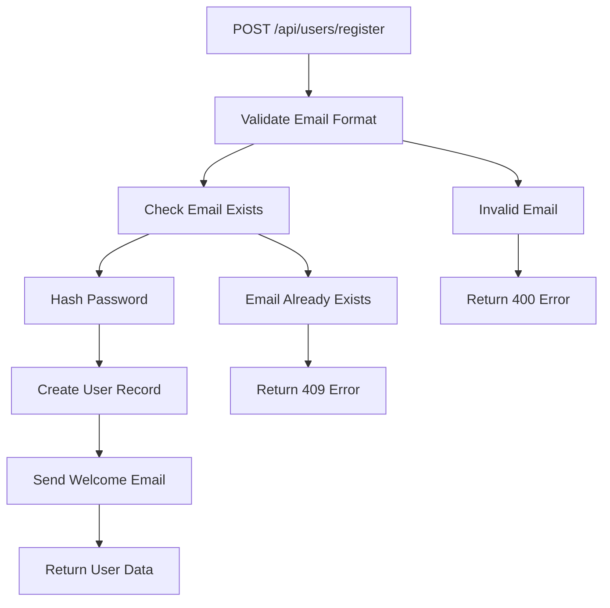
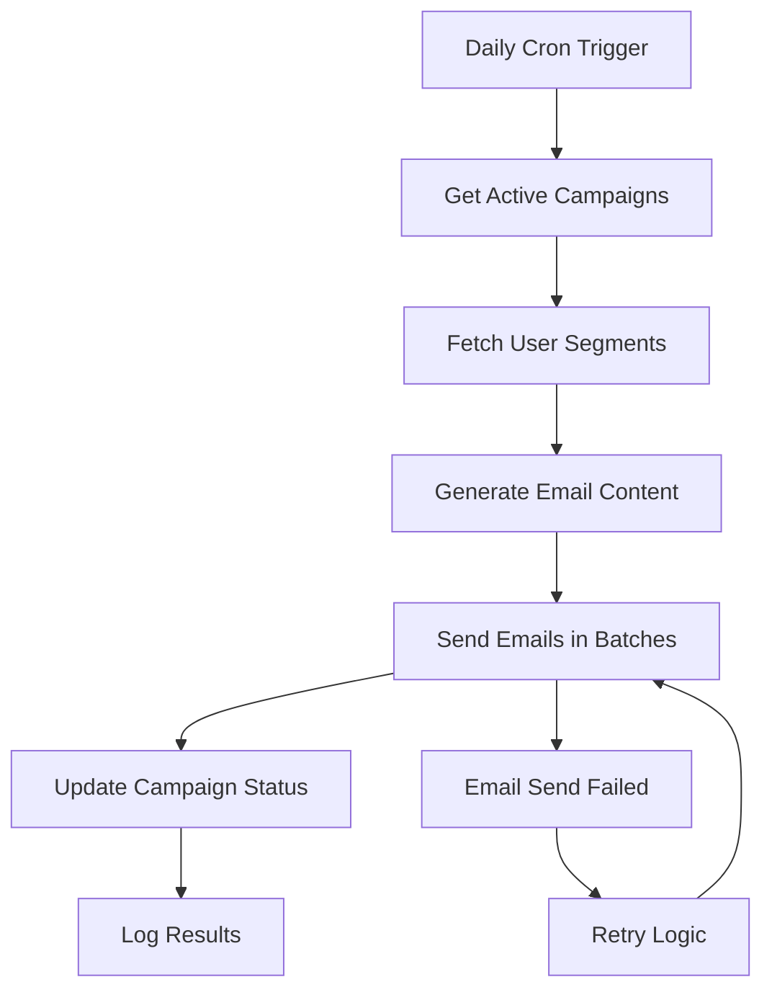

# 🌊 Flow - Real-World Use Cases

**Practical examples for developers who want to understand their codebase workflows**

## 🎯 Quick Commands for Real Projects

### 1. **E-commerce API Controller Analysis**
```bash
# Analyze your Express.js e-commerce API
flow generate --input ./src/controllers --output ./docs/workflows --format mermaid

# What you get: Visual workflow of your UserController, ProductController, OrderController
```

### 2. **React Admin Dashboard Workflows**
```bash
# Understand your React admin panel workflows
flow generate --input ./src/components/admin --output ./docs/admin-workflows --format all

# What you get: User management flows, data visualization workflows, form submission processes
```

### 3. **Scheduled Tasks & Cron Jobs**
```bash
# Analyze your background jobs and scheduled tasks
flow generate --input ./src/jobs --output ./docs/scheduled-workflows --format json

# What you get: Email sending workflows, data cleanup processes, report generation flows
```

### 4. **API Integration Workflows**
```bash
# Map out your third-party API integrations
flow generate --input ./src/services --output ./docs/integration-workflows --format mermaid

# What you get: Payment gateway flows, social media integrations, external API calls
```

## 🏗️ Real-World Scenarios

### **Scenario 1: E-commerce User Registration Flow**

**Command:**
```bash
flow generate --input ./src/controllers/UserController.ts --output ./docs --format mermaid
```

**What Flow generates:**


### **Scenario 2: React Component Lifecycle Analysis**

**Command:**
```bash
flow generate --input ./src/components/UserProfile.tsx --output ./docs --format json
```

**What Flow generates:**
```json
{
  "workflows": [
    {
      "id": "UserProfile_Component",
      "name": "UserProfile Component Workflow",
      "description": "Complete user profile management workflow",
      "framework": "react",
      "nodes": [
        {
          "id": "mount",
          "type": "lifecycle",
          "label": "Component Mount",
          "description": "useEffect(() => { fetchUserData() }, [])"
        },
        {
          "id": "fetch_user",
          "type": "api_call",
          "label": "Fetch User Data",
          "description": "GET /api/users/:id"
        },
        {
          "id": "update_profile",
          "type": "form_submission",
          "label": "Update Profile",
          "description": "PUT /api/users/:id"
        }
      ],
      "edges": [
        {
          "id": "mount_to_fetch",
          "source": "mount",
          "target": "fetch_user",
          "label": "Auto-fetch on mount"
        },
        {
          "id": "fetch_to_update",
          "source": "fetch_user",
          "target": "update_profile",
          "label": "User can update"
        }
      ]
    }
  ]
}
```

### **Scenario 3: Payment Processing Workflow**

**Command:**
```bash
flow generate --input ./src/services/PaymentService.ts --output ./docs/payment --format all
```

**What Flow generates:**
- **Mermaid Diagram**: Visual payment flow
- **JSON**: Structured payment process data
- **PNG/SVG**: Exportable diagrams for documentation

### **Scenario 4: Scheduled Email Campaign**

**Command:**
```bash
flow generate --input ./src/jobs/EmailCampaignJob.ts --output ./docs/email-workflows --format mermaid
```

**What Flow generates:**


## 🚀 Advanced Real-World Commands

### **Multi-Framework Project Analysis**
```bash
# Analyze a full-stack project with React frontend + Node.js backend
flow generate --input ./src --output ./docs/full-stack-workflows --format all --framework auto-detect
```

### **Microservices Architecture Mapping**
```bash
# Map out your microservices workflows
flow generate --input ./services --output ./docs/microservices --format mermaid --parallel --workers 8
```

### **Database Query Workflow Analysis**
```bash
# Analyze your database operations
flow generate --input ./src/models --output ./docs/db-workflows --format json --include-database
```

### **API Endpoint Documentation**
```bash
# Generate API workflow documentation
flow generate --input ./src/routes --output ./docs/api-workflows --format all --include-api
```

## 🎯 Framework-Specific Examples

### **Express.js API Controllers**
```bash
# Analyze your Express routes and middleware
flow generate --input ./routes --output ./docs/api --format mermaid
```

### **Next.js API Routes**
```bash
# Analyze your Next.js API routes
flow generate --input ./pages/api --output ./docs/nextjs-api --format json
```

### **Vue.js Component Workflows**
```bash
# Analyze your Vue components
flow generate --input ./src/components --output ./docs/vue-workflows --format mermaid
```

### **Angular Services & Components**
```bash
# Analyze your Angular services
flow generate --input ./src/app --output ./docs/angular-workflows --format all
```

## 📊 Performance Analysis Commands

### **Code Optimization Analysis**
```bash
# Get optimization suggestions for your codebase
flow optimize --input ./src --output ./optimization-report --format html
```

### **Performance Bottleneck Detection**
```bash
# Find performance issues in your workflows
flow generate --input ./src --output ./docs --optimize --verbose
```

## 🔧 Integration with CI/CD

### **GitHub Actions Integration**
```yaml
# .github/workflows/workflow-analysis.yml
name: Workflow Analysis
on: [push, pull_request]
jobs:
  analyze:
    runs-on: ubuntu-latest
    steps:
      - uses: actions/checkout@v2
      - name: Analyze Workflows
        run: |
          npx flow generate --input ./src --output ./docs/workflows --format all
      - name: Upload Workflows
        uses: actions/upload-artifact@v2
        with:
          name: workflow-diagrams
          path: ./docs/workflows
```

### **Documentation Generation**
```bash
# Generate documentation for your entire project
flow generate --input ./src --output ./docs --format all --diagram-format svg
```

## 🎨 Output Formats for Different Use Cases

### **For Documentation (SVG)**
```bash
flow generate --input ./src --output ./docs --format mermaid --diagram-format svg
```

### **For API Documentation (JSON)**
```bash
flow generate --input ./src/routes --output ./api-docs --format json --include-api
```

### **For Team Collaboration (PNG)**
```bash
flow generate --input ./src --output ./docs --format mermaid --diagram-format png
```

### **For Code Review (YAML)**
```bash
flow generate --input ./src --output ./review --format yaml --verbose
```

## 🚀 Pro Tips

### **1. Analyze Specific Features**
```bash
# Only analyze authentication-related code
flow generate --input ./src/auth --output ./docs/auth-workflows
```

### **2. Compare Before/After Refactoring**
```bash
# Generate workflows before refactoring
flow generate --input ./src --output ./docs/before-refactor

# After refactoring, compare the workflows
flow generate --input ./src --output ./docs/after-refactor
```

### **3. Team Onboarding**
```bash
# Generate comprehensive project overview
flow generate --input ./src --output ./docs/onboarding --format all --verbose
```

### **4. Performance Monitoring**
```bash
# Monitor workflow performance over time
flow generate --input ./src --output ./docs/performance --optimize --cache
```

---

**These are real commands you can run right now on your projects!** 🚀
