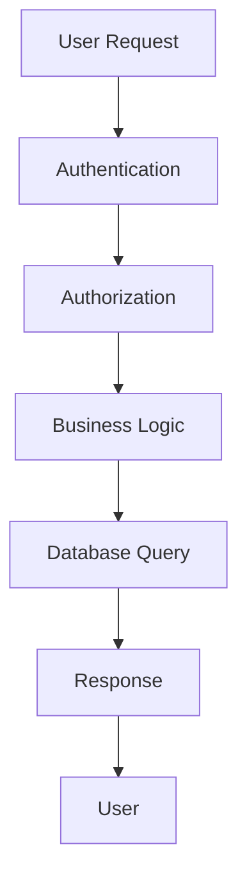

# 🌊 Flow - Universal Workflow Generator

**The most powerful and flexible workflow generator for any project, any framework, any situation.**

## 🎯 What is Flow?

Flow is a universal workflow generator that creates beautiful, interactive diagrams and documentation from any codebase. Whether you're working with React, Vue, Angular, Node.js, Laravel, Python, or any other framework - Flow understands your code and generates comprehensive workflows.

## ✨ Key Features

### 🌍 **Universal Support**
- **Frontend**: React, Vue.js, Angular, Svelte, Next.js, Nuxt.js
- **Backend**: Node.js, Express, NestJS, Laravel, Django, Spring Boot
- **Mobile**: React Native, Flutter, Ionic, Xamarin
- **Desktop**: Electron, Tauri, .NET WPF, Java Swing
- **Languages**: JavaScript, TypeScript, Python, Java, C#, PHP, Go, Rust

### 🚀 **Advanced Capabilities**
- **Async/Sync Processing**: Handle both synchronous and asynchronous workflows
- **Real-time Analysis**: Live code analysis and workflow generation
- **Pattern Recognition**: Automatically detects architectural patterns
- **Performance Metrics**: Detailed performance analysis and optimization suggestions
- **Integration Ready**: Works with any CI/CD, monitoring, and deployment system

### 🎨 **Beautiful Output**
- **Interactive Diagrams**: Mermaid, D3.js, and custom visualizations
- **Multiple Formats**: JSON, YAML, HTML, PDF, PNG, SVG
- **Live Documentation**: Auto-updating documentation websites
- **API Integration**: RESTful APIs for programmatic access

## 🚀 Quick Start

### Installation

```bash
# Install globally
npm install -g flow

# Or use with npx
npx flow generate --input ./src --output ./workflows
```

### Basic Usage

```bash
# Generate workflows for your project
flow generate

# Analyze without generating files
flow analyze

# Detect frameworks and languages
flow detect

# Get optimization suggestions
flow optimize
```

## 📊 Real-World Examples

### React Component Workflow
```bash
# Analyze a React project
flow generate --input ./src --framework react --output ./react-workflows

# Generated output:
# - Component lifecycle diagrams
# - Hook dependency graphs
# - State management flows
# - Performance metrics
```

### Node.js API Workflow
```bash
# Analyze a Node.js API
flow generate --input ./api --framework nodejs --output ./api-workflows

# Generated output:
# - Request/response flows
# - Middleware chains
# - Database query patterns
# - Error handling flows
```

### Microservices Architecture
```bash
# Analyze microservices
flow generate --input ./services --output ./microservice-workflows --pattern api-gateway

# Generated output:
# - Service communication diagrams
# - API gateway patterns
# - Data flow between services
# - Deployment workflows
```

## 🏗️ Architecture Patterns

Flow recognizes and generates workflows for common architectural patterns:

### **MVC Pattern**
- Model-View-Controller separation
- Request/response flow
- Data binding patterns
- Used in Laravel, Rails, Spring MVC

### **Repository Pattern**
- Data access abstraction
- Service layer integration
- Database query optimization
- Used in .NET, Java, Node.js

### **Observer Pattern**
- Event-driven architecture
- Pub/Sub patterns
- Reactive programming
- Used in React, Vue, Angular

### **API Gateway Pattern**
- Microservices communication
- Load balancing
- Authentication/authorization
- Used in AWS, Kong, Zuul

### **CQRS Pattern**
- Command Query Responsibility Segregation
- Event sourcing
- Read/write model separation
- Used in .NET, Java, Node.js

## 🔧 Advanced Configuration

### Framework-Specific Options

#### React
```bash
flow generate --framework react --include-hooks --include-lifecycle --include-state
```

#### Vue.js
```bash
flow generate --framework vue --include-composition-api --include-options-api
```

#### Angular
```bash
flow generate --framework angular --include-services --include-guards --include-interceptors
```

#### Node.js
```bash
flow generate --framework nodejs --include-middleware --include-routes --include-database
```

### Output Formats

```bash
# JSON for programmatic use
flow generate --format json

# YAML for configuration
flow generate --format yaml

# Mermaid for documentation
flow generate --format mermaid

# Visual diagrams
flow generate --diagram-format png

# All formats
flow generate --format all
```

### Performance Optimization

```bash
# Enable parallel processing
flow generate --parallel --workers 8

# Enable caching
flow generate --cache

# Include performance metrics
flow generate --optimize --metrics
```

## 🌐 Integration Examples

### CI/CD Integration

#### GitHub Actions
```yaml
name: Flow Analysis
on: [push, pull_request]
jobs:
  analyze:
    runs-on: ubuntu-latest
    steps:
      - uses: actions/checkout@v3
      - uses: actions/setup-node@v3
        with:
          node-version: '18'
      - run: npm install -g flow
      - run: flow generate --output ./workflows
      - uses: actions/upload-artifact@v3
        with:
          name: workflows
          path: ./workflows
```

#### GitLab CI
```yaml
stages:
  - analyze
flow_analysis:
  stage: analyze
  image: node:18
  script:
    - npm install -g flow
    - flow generate --output ./workflows
  artifacts:
    paths:
      - workflows/
```

### Docker Integration

```dockerfile
FROM node:18-alpine
WORKDIR /app
COPY package*.json ./
RUN npm install -g flow
COPY . .
RUN flow generate --output ./workflows
EXPOSE 3000
CMD ["node", "dist/index.js"]
```

### Kubernetes Integration

```yaml
apiVersion: apps/v1
kind: Deployment
metadata:
  name: flow-app
spec:
  replicas: 3
  selector:
    matchLabels:
      app: flow-app
  template:
    metadata:
      labels:
        app: flow-app
    spec:
      containers:
      - name: flow-app
        image: flow-app:latest
        ports:
        - containerPort: 3000
        env:
        - name: FLOW_ENABLED
          value: "true"
```

## 📈 Performance Metrics

Flow provides detailed performance analysis:

### Code Metrics
- **Cyclomatic Complexity**: Measures code complexity
- **Lines of Code**: Total and per-file metrics
- **Dependencies**: External and internal dependencies
- **API Calls**: HTTP requests and responses
- **Database Queries**: Query patterns and optimization

### Performance Analysis
- **Execution Time**: Method and function timing
- **Memory Usage**: Heap and stack analysis
- **Cache Performance**: Hit/miss ratios
- **Bottleneck Detection**: Performance bottlenecks
- **Optimization Suggestions**: Automated recommendations

## 🎨 Output Examples

### Mermaid Diagram


### JSON Output
```json
{
  "workflows": [
    {
      "id": "user-authentication",
      "name": "User Authentication Flow",
      "framework": "react",
      "nodes": [
        {
          "id": "login-form",
          "type": "process",
          "label": "Login Form"
        }
      ],
      "edges": [
        {
          "source": "login-form",
          "target": "validation",
          "label": "Submit"
        }
      ]
    }
  ],
  "statistics": {
    "totalComponents": 15,
    "totalMethods": 45,
    "frameworks": { "react": 10, "nodejs": 5 },
    "complexity": { "low": 20, "medium": 15, "high": 10 }
  }
}
```

## 🔌 API Integration

### RESTful API
```bash
# Start Flow API server
flow serve --port 3000

# Generate workflow via API
curl -X POST http://localhost:3000/api/workflows \
  -H "Content-Type: application/json" \
  -d '{"input": "./src", "framework": "react"}'

# Get workflow status
curl http://localhost:3000/api/workflows/123/status
```

### Programmatic Usage
```javascript
import { Flow } from 'flow';

const flow = new Flow({
  framework: 'react',
  language: 'typescript',
  parallel: true,
  cache: true
});

// Generate workflows
const result = await flow.generate({
  input: './src',
  output: './workflows'
});

// Analyze project
const analysis = await flow.analyze('./src');

// Get optimizations
const optimizations = await flow.optimize('./src');
```

## 🛠️ Development

### Contributing
```bash
# Clone repository
git clone https://github.com/flow-tool/flow.git

# Install dependencies
npm install

# Build project
npm run build

# Run tests
npm test

# Run linting
npm run lint
```

### Testing
```bash
# Run unit tests
npm test

# Run integration tests
npm run test:integration

# Run performance tests
npm run test:performance

# Run with coverage
npm run test:coverage
```

## 📚 Documentation

- [Getting Started](./getting-started.md)
- [API Reference](./api-reference.md)
- [Configuration](./configuration.md)
- [Integration Guide](./integration.md)
- [Performance Guide](./performance.md)
- [Troubleshooting](./troubleshooting.md)

## 🤝 Support

- **Documentation**: [https://flow-tool.dev](https://flow-tool.dev)
- **GitHub**: [https://github.com/flow-tool/flow](https://github.com/flow-tool/flow)
- **Issues**: [https://github.com/flow-tool/flow/issues](https://github.com/flow-tool/flow/issues)
- **Discussions**: [https://github.com/flow-tool/flow/discussions](https://github.com/flow-tool/flow/discussions)

## 📄 License

MIT License - see [LICENSE](../LICENSE) file for details.

---

**Made with ❤️ for the global developer community**
